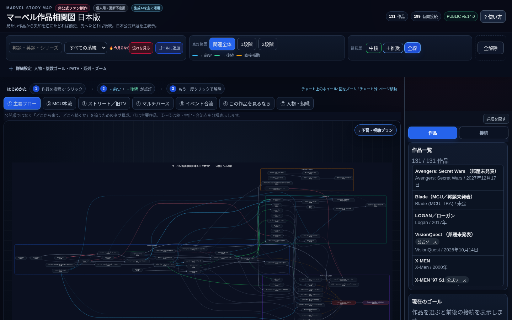

## v5.20.5 — ③ 強い系列線を一部復帰

- v5.20.4 では「孤立して見える補助枝線」を減らしましたが、その結果 **本来つながって見えた方が自然な系列線** まで弱くなった可能性がありました。
- そこで今回は、**明らかに同系列と見なせる強い接続だけ** を一部復帰しています。
- `Captain America / Black Widow / Thunderbolts` 周辺は、1本の系列線として再接続しました。
- `I Am Groot S1 → S2` を同列接続しました。
- `Thor: The Dark World → Ragnarok → Love and Thunder` を同列接続しました。
- 逆に、説明用の弱い汎用枝線（shared→cosmic など）は引き続き抑えています。

## v5.20.4 — ③ 孤立して見える枝線の整理

- ユーザー提供スクリーンショットで、**接続していないように見える縦枝線** を確認したため、Stage C の補助接続を整理しました。
- MCU 内の `共有イベントの背骨 → 宇宙 / 魔術 / Ground` を示す**汎用枝線**は削除しました。これらは説明上は便利でも、スマホでは「どこにも繋がっていない棒」に見えやすかったためです。
- SSU 内の `Venom本線 → 独立作品` を示す汎用枝線も削除しました。
- その代わり、残す縦接続（FOX 系列など）には **小さなジョイント点** を付けて、接続の開始・終了位置を明示しました。
- 物語系列の所属は、世界線外枠とレーン見出しで把握する方向へ寄せています。

## v5.20.3 — ③「世界線だけ箱 / 物語系列はレーン見出し」へ整理

- スマホ実機スクリーンショット監査を受け、③「世界線・時系列」の入れ子枠を整理しました。
- **世界線（Spider-Man / MCU / SSU / FOX X-MEN）のみ外周ボックス**を残し、内側の物語系列は四辺を囲う箱ではなく、**色付き見出し + 上辺のレール**へ変更しました。
- これにより、`初期アベンジャーズ系 / 宇宙・マーベルズ系 / 魔術・マルチバース系 / 街・地上サイド / ワカンダ・量子・新世代` などの内枠同士が重なる問題を避けています。
- Spider-Man 内の `Raimi / Amazing / MCU Spider-Man`、SSU 内の `Venom本線 / 独立作品`、FOX 内の `旧系列 / 改変後系列 / 位置づけ慎重` も同じレーン見出し方式へ統一しました。
- 枠内ナビは、中央を覆う大きなパネルから **小型・横スクロール式のチップ列**へ縮小しました。スマホではタイトル行を省略し、1列のチップ中心で表示します。
- `枠全体` は新しい世界線外枠も正しく対象にできるよう、group selector を汎用化しています。

## v5.20.2 — ③ スマホでの枠見出し被りを追加整理

- スクリーンショット監査を受けて、**系列枠の見出し帯が1段目カードに被る問題** を追加で整理しました。
- `groupBox()` に **見出し用の上部クリアランス** を導入し、見出し帯をカードの真上に退避させました。
- 系列枠の **サブ見出しを大幅に削減** し、スマホでは補助ラベル（小さなサブ説明・補助線ラベル）を非表示化しました。
- これにより、カード本文・年表示・系列見出しの競合を減らしています。

## v5.20.1 — ③ 多段時系列の重なり整理

- v5.20.0 の「大枠＝世界線 / 段＝物語系列」レイアウトを維持しつつ、**文字重なりと線のカード被り** を整理しました。
- カード間の横方向間隔を広げ、少し横長に戻して可読性を改善しました。
- 行間も拡大し、Spider-Man / MCU / SSU / FOX 各ブロックの縦方向の余白を増やしました。
- `branchBetweenRows` の縦接続線は、**カード中央を貫く方式から、列のすき間を通る方式** に変更し、カードへの被りを減らしました。
- 系列枠のサブ見出しや補助ラベルを短縮・削減し、作品名と大枠ラベルを主役にしました。

## v5.20.0 — ③「大枠＝世界線 / 段＝物語系列」へ再構成

- ③「世界線・時系列」の設計を見直し、**大枠＝世界線（ユニバース）**、**その中の段＝直接つながる物語系列** という表示へ寄せました。
- 特に MCU は1本の横一直線ではなく、`共有イベントの背骨 / 初期アベンジャーズ系 / 宇宙・マーベルズ系 / 魔術・マルチバース系 / 街・地上サイド / ワカンダ・量子・新世代 / 補助系列・今後` のように、**同じMCU内でも別段で表示**します。
- これにより、「同じ世界線だけど直接の物語つながりは薄い」作品を無理に同じ線へ載せずに済むようにしました。
- Spider-Man 系列も `Raimi / Amazing / MCU Spider-Man` を別段表示し、`No Way Home` 付近で交差させています。
- 横幅は従来の Stage C より抑えめにし、その代わりに高さ方向へ展開しています。
- 上部ジャンプ、枠内ナビ、関係データ本体は維持しています。

# マーベル作品相関図 日本版

マーベル映像作品を、前史・後続や予習ルートからたどれる非公式・非商用のインタラクティブ相関図です。
見たい作品をゴールに選ぶと、関連作品や見る順番を確認できます。

## 使い方

- PCでは作品を左クリックすると関連ラインを表示し、右側の作品詳細も同時に更新します。
- スマホでは作品をタップするとその作品をゴールにし、前史・後続の接続を表示します。同じ作品をもう一度タップすると解除、別作品をタップするとゴールを切り替えます。
- スマホの作品詳細はチャート上ではなく、下の「予習・視聴プラン」の各作品にある「詳細を見る」から展開できます。
- PCでは右側の詳細欄または作品の右クリックからゴールを追加・解除できます。スマホではチャートのタップが基本のゴール選択です。
- 「予習・視聴プラン」で見る順番や視聴済み状況を確認できます。
- スマホでは上部の検索から作品を探し、「関係地図 ▼」から5つの表示ビューを切り替えられます。
- スマホでは1本指で移動、2本指でズームできます。
- PCではドラッグで移動、チャート上のホイールでズームできます。

## 予習プランを共有する

- **画像で共有** — 現在の予習プランをPNG画像として共有できます。
- **一緒に見る** — 共有リンクから最大4人で参加し、それぞれの視聴済み状況をほぼリアルタイムで共有できます。

通常の視聴済みチェックはブラウザ内に保存されます。共有ルームは30日間利用がないと削除されます。

## 注意事項

非公式・非商用のファン制作です。Marvel / Disney および各作品・キャラクターに関する商標・著作権は各権利者に帰属し、本サイトは権利者各社とは提携していません。

接続の「中核 / 推奨 / 参照」は視聴ガイド上の独自分類です。

## v5.18.2 — ③ 左分類追従 + 作品名内枠

- ③「世界線・時系列」で、左端の分類名を横パンしても画面左に残る追従ラベルへ変更しました。
- 追従ラベルは縦パン・ズーム時には各レーンの位置へ同期します。
- 各作品カード内の作品名部分に専用の枠を追加し、作品名のまとまりを見分けやすくしました。
- 時系列順、分岐位置、CHRONOLOGY_META、関係地図データは変更していません。
- 回帰テスト 3 / 3 PASS、inline JavaScript 16 / 16 PASS。

## v5.18.4 — ③ 作品カードを①関係地図型へ統一

- ③「世界線・時系列」の作品表示を、①「関係地図」と同じ考え方の**作品全体を囲う1枚カード**へ変更しました。
- カードは `濃い背景 + 系統色の外枠 + 中央の作品名 + 下段の公開時期` で表示します。
- v5.18.2〜5.18.3で入れていた `分類チップ / 内側タイトル枠 / 確度注記` は作品カード内から撤去しました。
- 分類名は左端の追従ラベルだけに残し、枠なしの細い色バー＋文字表示を維持します。
- 作品カードを見やすくするため、③専用カードを横190 / 高64相当へ拡大し、左→右の本流・分岐構造は維持しました。
- 時系列データ、分岐位置、NODES / EDGES / CHAR_LINKS / WORK_DETAILS / CHRONOLOGY_META の内容は変更していません。

## v5.19.3 — ③ 大枠の中から呼べる「枠内ナビ」を追加

- ③「世界線・時系列」の主要な大枠に **ナビ** を追加しました。図の上まで戻らず、見ている枠からそのまま系列内の節目へ移動できます。
- 大枠の **見出し帯そのもの** と、右側の `ナビ` ボタンのどちらを押しても、小さなジャンプパレットが開きます。
- パレットは作品を全部並べるのではなく、その枠を見るうえで意味のある節目だけを表示します。
  - Spider-Man系列: `枠全体 / Raimi / Amazing / MCU版 / No Way Home`
  - SSU: `枠全体 / Venom / 独立作品`
  - FOX X-MEN: `枠全体 / 旧系列 / Days of Future Past / 改変後 / LOGAN周辺`
  - 初期アベンジャーズ系: `枠全体 / Iron Man / Captain America / Thor / Avengers`
  - 魔術・マルチバース系: `枠全体 / Doctor Strange / Wanda / Loki / MoM`
  - ほか Guardians / ワカンダ・量子・マーベルズにも対応。
- 作品へのジャンプは **現在のズーム倍率を維持**し、`枠全体` だけは対象枠が見えるカメラへ調整します。
- スマホ高速Canvasでも枠内ナビをタップできるよう、専用ヒット領域を追加しました。
- ズームアウト時のヒット補助が隣の枠と重なる場合は、**実領域の厳密判定を先に行う**ことで誤パレットを防ぎます。
- 上部の既存ジャンプUIは比較用・補助用として残しています。

## v5.19.2 — スマホCanvasでシリーズ大枠を描画

- スマホ版で③「世界線・時系列」のシリーズ大枠が見えない不具合を修正しました。
- 原因は、モバイル高速Canvas描画が `path / polygon / polyline / text` しか取り込まず、**SVGの `rect` を描画対象外にしていた**ことです。
- モバイルCanvasに `rect` と角丸 `rx` の描画対応を追加しました。
- これにより、シリーズ大枠・色付き見出し帯・レーン背景などの `rect` 要素もスマホで描画されます。
- PC側SVG、作品カード、接続線、ジャンプ機能、時系列データは変更していません。

## v5.19.1 — ③ 世界線・時系列の大枠を「関係地図寄り」に強調

- ③「世界線・時系列」のシリーズ枠を、前版の薄い半透明矩形から、**関係地図の大枠を参考にした「見出し付きの大枠」**へ変更しました。
- 各まとまり枠は、**太めの外枠 + 色付き見出し帯 + 薄い背景色** で構成され、少し離れて見ても系列名が分かりやすくなっています。
- Spider-Man / SSU / FOX X-MEN の大枠を強調しつつ、サブ枠も読みやすく整理しました。
- MCU側は細かい枠の数をやや整理し、`初期アベンジャーズ系 / ガーディアンズ系 / 魔術・マルチバース系 / ワカンダ・量子・マーベルズ` のように、**大まかなまとまりが分かる** 表示へ寄せています。
- 作品カード、接続線、ジャンプ機能、時系列データは変更していません。

## v5.19.0 — ③ 世界線・時系列に「シリーズまとまり枠」を追加

- ③「世界線・時系列」で、**少し離れて見ても各系列の位置が分かるように、半透明の大きな囲み枠**を追加しました。
- まずは大まかなまとまりとして、`Spider-Man系列 / SSU / FOX X-MEN / MCU本流の主要シリーズ` を可視化しています。
- Spider-Man系列の中では、さらに `Raimi / Amazing / MCU Spider-Man` も個別に囲って区別しています。
- SSUは `Venom本線` と `独立作品`、FOX側は `旧系列 / 改変後系列 / 位置づけ慎重` もサブ枠で表示します。
- MCU本流では、`キャプテン・アメリカ系 / アイアンマン系 / ソー系 / ガーディアンズ系 / アントマン系 / ドクター・ストレンジ系 / ワカンダ系 / キャプテン・マーベル系` を**ざっくり**示す背景枠を追加しました。
- カード、接続線、ジャンプ機能、時系列データは変更していません。

## v5.18.9 — スマホ外側スクロール時の勝手な極小化を修正

- スマホでページ外側をスクロールした際、ブラウザUIの高さ変化に伴う `resize` でチャートが `fitView()` され、**最小ズーム近くまで縮小される**不具合を修正しました。
- モバイルの `resize / media query change / orientationchange` では、**現在のカメラを保持したまま再描画**するよう変更しました。
- これにより、③「世界線・時系列」を含むチャートで、外側スクロールだけで勝手に全体縮小しにくくなります。
- ジャンプ機能・Spider-Man帯・作品カード・データ内容は変更していません。

## v5.18.8 — ③ 世界線・時系列に主要シリーズジャンプを追加

- ③「世界線・時系列」の上部に **ジャンプ** UI を追加しました。
- ジャンプ先は分類ではなく、**主要シリーズの最初の作品**です。
- 収録ジャンプ先: `MCU開始 / Spider-Man系列 / SSU / FOX X-MEN / アイアンマン / キャプテン・アメリカ / ソー / ガーディアンズ / アントマン / ドクター・ストレンジ / ブラックパンサー / キャプテン・マーベル / MCUスパイダーマン`。
- ジャンプ時は **現在のズーム倍率を維持**しつつ、対象カードを見やすい位置へ移動します。
- Spider-Man帯・作品カード・接続線・時系列データは変更していません。

## v5.18.7 — ③ 始点・終点の空中線を除去

- ③「世界線・時系列」で、作品カードの始点側・終点側に残っていた**接続先のない短い横棒**を除去しました。
- レーン全体に敷いていた装飾用の横線を廃止し、線は「カード→カード」または「分岐元→実在するカード」の場合だけ描画します。
- `No Way Home → MCU本流へ` の戻り線も空中で止めず、次のMCU作品カードへ直接着地させました。
- Spider-Man統合帯、作品カード、タイトル収まり、時系列データは変更していません。
- dangling-line回帰 2/2 PASS、Spider-Man/タイトル回帰 9/9 PASS、inline JavaScript 16/16 PASS。

## v5.18.6 — ③ Spider-Man系列を1つの帯へ統合

- ③「世界線・時系列」で Raimi / Amazing を独立した大分類として扱う方式をやめ、**Spider-Man系列**の1つの帯へまとめました。
- 帯の内部は `Raimi / Amazing / MCU Spider-Man` の3段構成です。
- MCU版Spider-Man 3作は中央MCU本流との重複表示をやめ、`Civil War` 付近からSpider-Man帯へ分岐する表示にしました。
- `No Way Home` は1枚だけ表示し、Raimi / Amazing / MCU版の3系列がそこへ右向きに収束するジャンクションとして扱います。
- `No Way Home` 後は作品カードへ誤った直接接続を作らず、構造線としてMCU本流へ戻す表示にしています。
- SSUはSpider-Man帯へ無理に統合せず、Venom本線と独立作品を含む別レーンのまま維持します。
- 作品名カード、左端追従分類、作品名幅フィットはv5.18.5を維持しています。
- NODES 131 / EDGES 199 / CHAR_LINKS 155 / WORK_DETAILS 131 / CHRONOLOGY_META 103 は内容不変です。

## v5.18.5 — ③ 作品名のカード内収まりを修正

- ③「世界線・時系列」の作品名改行を、固定文字数ではなく**表示幅ベース**へ変更しました。
- ①「関係地図」と同じ `10.5px` 基準の作品名表示へ寄せ、長い邦題は2行に自動分割します。
- タイトル末尾を切り捨てる処理を撤去し、作品名全文を保持します。
- ③収録103作品すべてについて、190pxカード内の有効幅170pxを超えないことを自動監査しています。
- 時系列順・分岐・分類追従・関係地図データは変更していません。

## v5.18.3 — ③ 世界線・時系列のラベル干渉調整

- ③「世界線・時系列」で、**作品カード側のタイトル枠を主役に戻す**よう見た目を調整しました。
- 左端の分類ラベル（Raimi / Amazing / MCU本流 / SSU / FOX X-MEN）は、**枠つきボックスではなく細い色バー＋文字**の追従表示へ変更しました。
- sticky分類ラベルの表示幅を縮小し、作品カードに干渉しにくくしました。
- 作品カード内のタイトル枠は、関係地図に近い「作品名が入る枠」として視認性を少し強めています。
- 時系列順・分岐位置・NODES / EDGES / CHAR_LINKS / WORK_DETAILS / CHRONOLOGY_META の内容は変更していません。

## v5.18.1 — ③ 世界線・時系列 Stage C レイアウト再設計

- ③「世界線・時系列」を、**中央にMCU本流の一直線、その上下に別世界線の横レーン**が並ぶ構図へ再設計しました。
- 接続は**すべて左→右**で読み進める前提に統一し、各別世界線は本流から枝分かれして右方向へ進みます。
- Raimi / Amazing は上段、SSU / FOX X-MEN は下段に再配置しました。
- FOX X-MENは `Days of Future Past` を分岐点として、旧系列→改変後系列→位置づけ慎重作品を右方向に分岐表示します。
- SSUはVenom本線と、Morbius / Madame Web / Kraven の独立枠を別段に分けています。
- `CHRONOLOGY_META` は維持し、Earth番号や作品内絶対年月日は引き続き推測で付けません。
- 関係地図の NODES 131 / EDGES 199 / CHAR_LINKS 155 / WORK_DETAILS 131 は変更していません。
- inline JavaScript 16 / 16 PASS。freshブラウザ画像検証はこのサンドボックス制約により未完了です。

## v5.18.0 — ③ 世界線・時系列 Stage C

- `③ 世界線・時系列` をプレースホルダーから実動のcontinuityビューへ更新しました。
- 初期レーンは `MCU / Raimi Spider-Man / Amazing Spider-Man / Sony Spider-Man Universe / FOX X-MEN・Deadpool` の5系統です。
- `CHRONOLOGY_META` は公開日用 `RELEASE_META` と分離し、公開順を作品内時系列として流用しません。
- MCUはDisney+公式「MCUコンプリート 時系列順」を基準にし、Loki / What If...? など時間・世界線を横断する作品は通常線から区別します。
- FOX X-MENは `Days of Future Past` を分岐点として、旧系列と改変後系列を別段で表示します。`LOGAN` と `ニュー・ミュータント` は位置づけを断定せず独立した保留段に置きます。
- SSUはVenom三部作と、Morbius / Madame Web / Kravenの独立枠を一本線へ強制統合しません。
- Brand New Day / Doomsday / Secret Wars は公開日とは別に、作品内時系列を `unknown / unplaced` として保持します。Earth番号・作品内絶対年月日は推測で付けません。
- 長いレーンは折返し線で行間を接続し、スマホでも一本のcontinuityとして追える構造です。
- 関係地図の NODES 131 / EDGES 199 / CHAR_LINKS 155 / WORK_DETAILS 131 と、v5.17.8のモバイル点灯方式、v5.17.10のカード間隔は変更していません。
- Stage C回帰テスト 10 / 10 PASS、inline JavaScript 16 / 16 PASS。現在のサンドボックスではローカルURLが管理ポリシーで遮断されるため、freshブラウザ画像検証は未完了です。

参考: Disney+公式「MCUコンプリート 時系列順」 / Marvel公式 `The Fantastic Four: First Steps`。

## v5.17.10 — 小枠と大枠の接触を追加補正

- v5.17.9で解消しきれなかった「小さい作品枠が大きい作品枠へ触れる」16組を、同一エリア内の2次元矩形距離で再監査しました。
- 小さい枠はv5.17.9のまま維持し、接触側に余裕のある大きい枠11作品だけを片側方向へ局所的に内側調整しています。
- 小枠×大枠の最小2次元クリアランスを10px以上にしました。
- 作品名・公開年の文字座標、既存矢印のpath / polygon幾何、NODES / EDGES / CHAR_LINKS / WORK_DETAILSは変更していません。
- v5.17.8のスマホ用prewarmed world overlayと、v5.17.9の44作品の小枠間隔調整を維持しています。

## v5.17.9 — 関係地図の過密カードを局所調整

- 関係地図で同じ行のカード間隔が8px未満だった32組・44作品だけを対象に、カード外枠を左右6px・上下2px内側へ調整しました。
- 最小のカード間隔は従来の -2px（2px重なり）から10pxへ改善しています。
- 作品名・公開年の文字座標、カード中心位置、既存144本の矢印経路は変更していません。
- 枠だけを内側へ寄せたため、既存矢印の先端にも数pxの余白ができ、作品枠へ埋まりにくくなります。
- v5.17.8のスマホ用prewarmed world overlayとゴール高速経路はそのまま維持しています。

## v5.17.7 — ゴール追加時の点灯準備を段階化

- ゴール追加直後は現在画面＋84px相当だけを即時点灯し、周囲1.6画面ぶんのワールド座標パッチ生成を同期経路から外しました。
- ローカルパッチは `requestAnimationFrame` で1フレーム約2.5msずつ生成し、完成後に全地図LOD 0.35キャッシュを1フレーム約4msずつ生成します。
- 新しいゴールへ切り替えた瞬間、前ゴール用に進行中のパッチ／全地図キャッシュ生成をキャンセルします。
- ゴール追加直後の補助矢印計算も非同期側へ回し、CanvasプリミティブのノードID／接続キーは構築時に一度だけ索引化します。
- v5.17.6のワールド座標切り出しを維持し、スワイプ時に点灯作品・矢印だけが浮くCSS transform経路は再導入していません。

## v5.17.6 — スマホ点灯レイヤーの浮きずれ対策

- ゴール選択直後、全地図点灯キャッシュ完成前に使っていたCSS transform追従を廃止しました。
- 現在位置の周囲約4画面分をワールド座標の低解像度パッチとして先読みし、背景Canvasと同じviewBox→drawImage計算で移動します。
- 全地図点灯キャッシュはv5.17.5同様、requestAnimationFrameで段階生成します。
- パッチ／全地図キャッシュとも同一座標系から切り出すため、点灯した作品・矢印だけがスワイプ時に漂うような見え方を抑えます。

## v5.17.4 — スマホ点灯矢印の移動ちらつき対策

- 矢印点灯中のパン／ピンチでは、viewport限定Canvasをtransform追従する方式を廃止しました。
- 点灯状態だけを関係地図全体の低解像度キャッシュ（LOD 0.35）へ保持し、移動中は現在位置を切り出して表示します。
- 移動先で矢印が急に描画されるちらつきを抑えつつ、ジェスチャー中の全プリミティブ再描画は行いません。
- 指を離した後は通常解像度の点灯レイヤーへ戻します。

## v5.17.2 — ② 公開順を「Marvel映像史」へ再設計

- 全131作品を1本の巨大な横長タイムラインへ並べる方式をやめ、歴史時代ごとのセクションを縦に連ねる表示へ変更しました。
- 時代区分は `各社ライセンス展開期 / Marvel Studios 自社製作への転換期 / MCU成立期 / 共有世界・多媒体拡張期 / 再編・統合移行期 / 配信・マルチバース統合期 / 現在・発表済み作品`。
- 時代名は公式区分ではなく、企業・制作体制・配信構造の転換点を一次資料優先で整理した編集上の区分です。
- 2005年の自社製作化、DisneyによるMarvel/Fox取得、SonyとのSpider-Man協業、Disney+開始などを歴史マーカーとして表示します。
- RELEASE_META 131件と①関係地図、199接続、155人物リンク、131詳細は変更していません。

## v5.15.5

- チャート直上の「つながり」を `最低限 / おすすめ / 完全版` に整理しました。
- チャートの「つながり」と予習プランの詳しさは双方向に連動します。
- 既定値は双方とも「おすすめ」です。
- SVG作品ラベルで `\n` が文字として見えていた改行表示を修正しました。

## v5.15.5

- スマホ右上の「☰ 操作」を撤去しました。
- チャートの「↓ 予習・視聴プラン」の左に `最低限 / おすすめ / 完全版` のプルダウンを常設しました。
- 予習プラン側も同じプルダウン表示にし、両方が同じ接続基準へ同期します。
- PCの詳細・高度な操作は従来どおり維持します。

## v5.15.5

- `最低限 / おすすめ / 完全版` が、線の表示だけでなく関連全体の再帰探索にも反映されるよう修正しました。
- 完全版の探索挙動は v5.15.4 と同じままです。
- 最低限は core、 おすすめは core + recommended、完全版は core + recommended + reference の許可範囲で再帰探索します。
- medium / weak 接続は従来どおり、選択作品への直接コンテキストとして扱います。

## v5.15.6

- 主要フロー76作品を「ホームエリア＋中央の合流帯」の地図型レイアウトへ試作しました。
- 作品は重複表示せず、各作品は1つのホームエリアにだけ置いています。
- エリアは `MCU本流 / 宇宙・Guardians / Spider-Man周辺 / Street・Marvel TV / FOX X-MEN / 魔術・別世界 / 合流・大型イベント` の7区画です。
- 概要図の77接続は意味・本数を変更せず、そのまま新しい配置へ引き直しています。
- 今回は「どこにどの作品があるか」を見つけやすくする配置試作で、接続線の整理は次段階です。

## v5.15.7

- v5.15.6で好評だった主要76作品の地図配置をそのまま固定しました。
- 残り55作品を同じ7エリア内へ小型カードとして追加し、全131作品を1枚の地図で探せるようにしました。
- 追加作品は関係する主要作品や同シリーズの近くへ寄せ、主要作品の位置・大きさは変更していません。
- 補助作品に関係する67本の接続を細い線として追加し、主要77本の線は従来どおり維持しています。
- 「主要フロー」タブ名は内容に合わせて「全体地図」へ変更しました。

## v5.15.8

- 全131作品ホームマップのうち、同じエリア間を繰り返し跨ぐ長距離線を「地区の隙間にある共通レーン」へ束ねました。
- 主要76作品・補助55作品の配置は v5.15.7 から変更していません。
- エリア内の短い接続や、1本だけのエリア跨ぎ線は従来のジオメトリを維持しています。
- 選択時は従来どおり個々の接続が点灯し、共通レーンを通って目的地側へ分岐します。

## v5.15.10

- スマホでゴールを1件解除するときも、追加時と同じく Canvas の点灯状態を即時更新し、重いDOM/UI再構築を2フレーム後へ回すようにしました。
- 「すべて解除」も Canvas の選択オーバーレイを即時消去してから、予習プラン・ゴール欄などを遅延更新します。
- ゴール追加・解除のたびに全矢印へ行っていた重要度クラス再付与とツールチップ再生成を廃止し、必要な初期化／接続基準変更時だけ実行します。
- refreshSelection 内で重複していた視聴済み消灯処理を1回にしました。
- v5.15.8 のホームマップ配置・束ね線・作品／接続データは変更していません。

## v5.15.10

- スマホのゴール横スクロール欄を安定化しました。
- ゴール欄のDOMを毎回丸ごと作り直さず、既存チップをID単位で差分更新します。
- ゴール追加・解除時はゴール欄を先に更新し、重い全体選択更新は90ms以上遅延します。
- 横スワイプ中・慣性スクロール中は重い更新を延期し、操作終了後に再開します。
- ゴール欄の scrollLeft を維持し、横スクロールの慣性を有効化しています。
- チャートSVG、接続データ、予習ロジック、束ね線のジオメトリは v5.15.9 から変更していません。

## v5.15.11

- スマホで追加済みゴールを選び直すとき、接続探索・予習プラン・作品一覧を再計算せず「現在ゴール」の表示だけ切り替えるようにしました。
- ゴール欄は新しく追加した作品ほど左に表示し、新規追加時は左端へ戻ります。
- ゴール集合そのものの内部順序は変更していないため、予習プランや共有状態の順序には影響しません。

## v5.15.12

- スマホで新しいゴールを追加した直後に発生していた、90ms後のフル選択更新を廃止しました。
- ゴール追加時は選択計算・ゴール欄更新・Canvas点灯だけで完了し、背面SVGとCanvasキャッシュを作り直しません。
- 予習プランは「予習プランを見る」を押した時に、保留中の内容だけ最新化します。
- PCの選択処理、作品・接続・人物・詳細データ、地図SVGは変更していません。

## v5.15.13

- スマホでゴールを1件削除した直後に残っていた、90ms後のフル選択更新を廃止しました。
- 「すべて解除」も同じ軽量経路へ揃え、背面SVGとCanvasキャッシュを作り直しません。
- 削除時は選択状態計算・ゴール欄更新・Canvas点灯更新だけで完了し、予習プランは「予習プランを見る」時に最新化します。
- PCの削除処理、ゴール追加処理、作品・接続・人物・詳細データ、地図SVGは変更していません。

## v5.16.0

- 公開ナビゲーションを `① 関係地図 / ② 公開順 / ③ 世界線・時系列 / ④ この作品を見るなら / ⑤ 人物・組織` の5ビューへ整理しました。
- 従来の「全体地図」は「関係地図」へ名称変更し、131作品の配置・接続線・データは v5.15.13 のまま維持しています。
- スマホでは横並びタブを出さず、上部の `関係地図 ▼` からビューを選びます。
- `④ この作品を見るなら` は既存の予習・視聴プランへ直接移動します。
- 旧 `MCU / ROAD TO DOOMSDAY / LEGACY / DOOMSDAY` パネルは内部に保持しつつ、通常の公開ナビゲーションからは外しました。
- `② 公開順` と `③ 世界線・時系列` は Stage A では軽量な入口のみです。作品データの本実装は次段階で追加します。

## v5.17.0

- `② 公開順` を全131作品で実装しました。映画は米国劇場公開日、配信作品はグローバル配信開始日を主基準にしています。
- 公開日メタデータは関係地図本体と分離し、日付が月までしか確定していない作品は月精度、未定作品は未定のまま表示します。推測日を作りません。
- 公開順は年ごとの帯で横方向に並び、同日作品は縦にスタックします。関係矢印は追加せず、ゴール選択時は位置を動かさず関連作品だけを点灯します。
- ②のSVGとスマホCanvasは初回表示時だけ生成します。初期表示の①関係地図では公開順用Canvasを作りません。
- Pixel 6相当 412×915 の headless Chromium で、公開順を開いた後のゴール追加・削除とも550ms後 `refreshSelection=0 / rebuildMobileCanvas=0` を確認しました。
- 2026-08-24時点の将来作品情報を再監査し、`Your Friendly Neighborhood Spider-Man S2` を2027年1月、`Spider-Man: Beyond the Spider-Verse` を2027年6月18日へ更新しました。`Wonder Man S2` は中止報道を公開順メタデータ側へ反映し、既存作品IDは互換性のため保持しています。

### v5.17.3 関係地図モバイル修正

- 矢印点灯中のパン／ピンチは、選択レイヤーを毎フレームCanvasへ描き直さず、GPU transformで追従。指を離した時だけ再描画します。
- 予習プランで視聴済みを変更した際、Canvas背景キャッシュ更新でゴール点灯レイヤーを失わないよう修正。
- チャートへ戻る際にも選択レイヤーを復元します。
- 点灯中の矢印先端は作品カード手前に約6pxの余白を取るよう調整しました。

## v5.17.5

- スマホのゴール選択直後は、現在画面＋周辺だけを先に点灯して入力を返すようにしました。
- パン／ピンチ用の全地図点灯キャッシュは、1フレーム約4msを上限に複数フレームへ分割して生成します。
- キャッシュ完成前に動かした場合は直前の点灯レイヤーを一時的に追従し、完成後はv5.17.4の全地図低解像度キャッシュへ自動で切り替えます。
- 作品・接続・人物・詳細データと関係地図配置は変更していません。

## v5.17.8 — 点灯Canvas事前準備＋直接索引描画

- 関係地図のスマホ点灯レイヤーを、v5.17.6のワールド座標方式を土台に再構成しました。
- 地図Canvas構築時に、作品ID→描画部品・接続ID→描画部品・ノード座標・既存接続キーを一度だけ索引化します。
- パン／ピンチ用の全地図点灯Canvasもゴール選択前に確保するため、ゴール追加時のCanvas新規確保をなくしました。
- ゴール追加時は131作品全体を走査せず、実際に点灯対象となる作品・接続だけを索引から直接描画します。
- スワイプ中は同じ全地図点灯Canvasを背景と同じviewBox式で切り出し、部分パッチやCSS transformへの切替を行いません。
- 作品・接続・人物・詳細データと関係地図配置は変更していません。
